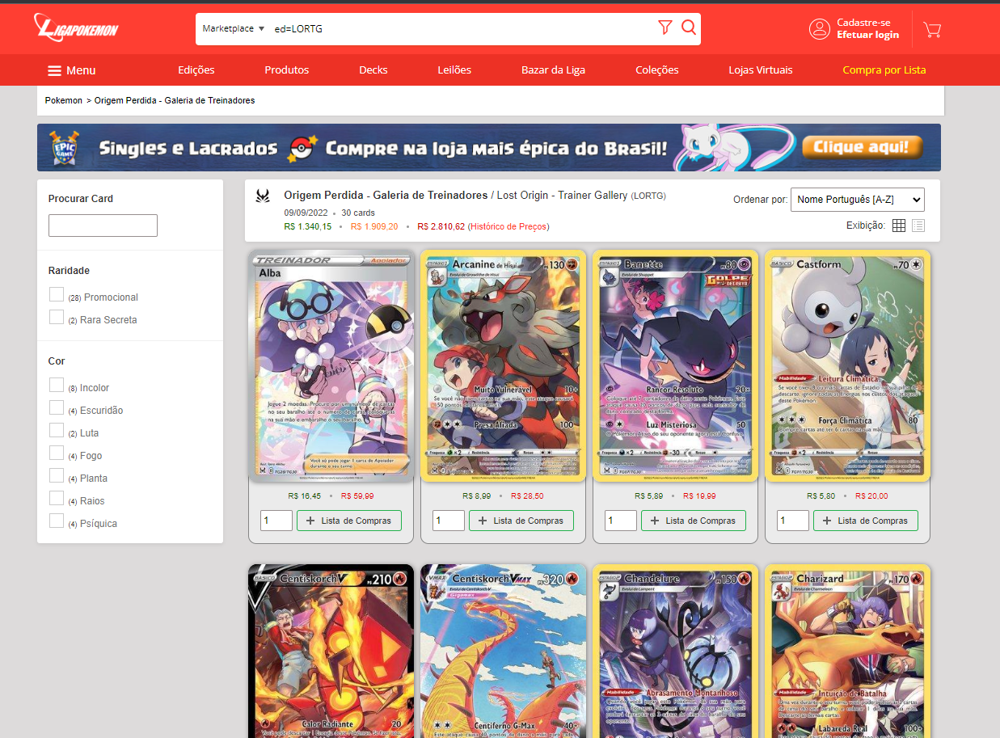
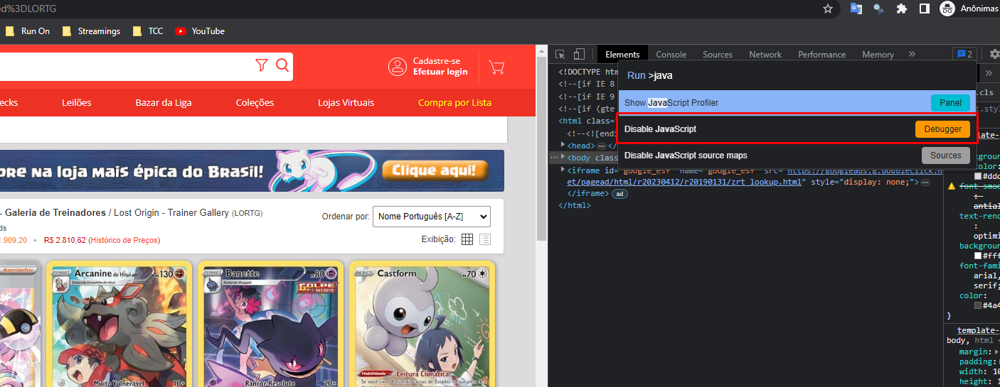
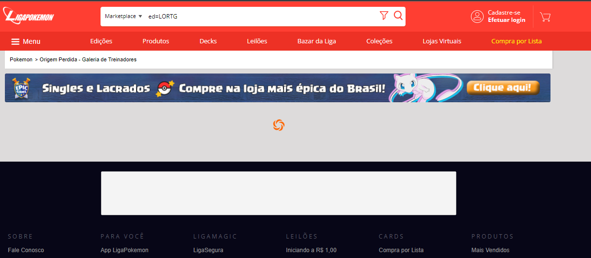

<b>COMO FOI REALIZADO ESTE SCRAPING</b>
 
<li>1 - Selecionei as URLs que deseja raspar;</li>
<li>2 - Inspecionei a página;</li>
<ul>
    <li>2.1 - Busquei o que deseja extrair;</li>
    <li>2.2 - Verifiquei se a página tinha conteúdo dinâmico.</li>
</ul>
<li>3 - Preparei o código;</li>
<li>4 - Armazenei os dados.</li>

#########################################################################################

<b>SOBRE A PÁGINA:</b> 

Após identificar os dados de interesse, foi o momento de analisar a anatomia da página (TAGs, Classes CSS, IDs),
mas o fator principal foi entender que havia uma renderização dinâmica. 

Para fazer a verificação o js foi desativado no navegador, indo ao DevTools do navegador, ctrl+shit+p (Windows, Linux) e digitando "javascript",
a opção de "disable" se mostra e ao desabilitar o js é só dar um refresh. 
 

Confirmado que alguns elementos da página estão sendo renderizados de modo dinâmico é necessário outra abordagem.
Para solucionar isto foi necessário utilizar ScrapySplash.

 

#########################################################################################

<b>Iniciando um projeto com Scrapy:</b> 
<li>Criando o projeto: scrapy startproject [nome_do_projeto]</li>
<li>Acessar diretório do projeto: cd [nome_do_projeto]</li>
<li>Criar o arquivo spider: scrapy genspider [script_name] [example.com]</li> 
(Spiders são classes que você define e que o Scrapy usa para coletar informações de um site.)

<b>Alguns comandos do Scrapy usados para testar a solução:</b> 
<li>Acessar ambiente de scraping shell para executar comandos: scrapy shell</li>
<li>Tentar fazer conexao com o site: fetch('[example.com]');</li>
<li>Testar o resultado de sua busca: response.css('class').get();</li>
<li>Realizar o crawl: scrapy crawl [nomeprojeto]</li>
<li>Salvar os resultados em um arquivo:</li>
<li>scrapy crawl nomeprojeto -O [result.json]</li> 
Com -o o arquivo é sempre reescrito. Com -O o arquivo é sobreescrito.
O formato de arquivo é a sua escolha, neste projeto optei por JSON. PAra saber de outros formatos busque a documentação da biblioteca.
Alguns carácteres salvos no arquivo json estavam encodados. A solução foi adicionar está
configuração no setup.py. 
FEED = 'json'
FEED_EXPORT_ENCODING = 'utf-8'

#########################################################################################

EXECUTANDO O PROJETO
ligaCard/Scripts/Activate.ps1